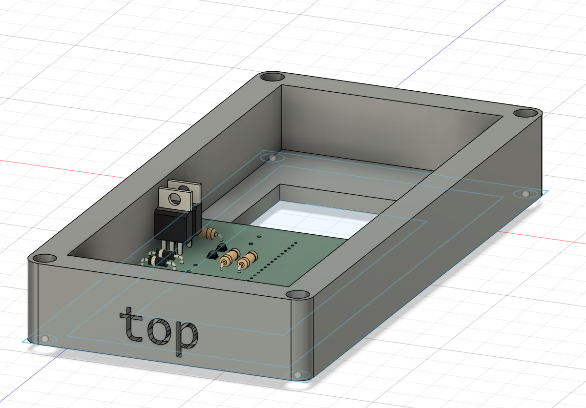

```                                                                                                                          
FFFFFFFFFFFFFFFFFFFFFF                                         CCCCCCCCCCCCC         tttt                            lllllll 
F::::::::::::::::::::F                                      CCC::::::::::::C      ttt:::t                            l:::::l
F::::::::::::::::::::F                                    CC:::::::::::::::C      t:::::t                            l:::::l 
FF::::::FFFFFFFFF::::F                                   C:::::CCCCCCCC::::C      t:::::t                            l:::::l 
  F:::::F       FFFFFFaaaaaaaaaaaaa  nnnn  nnnnnnnn     C:::::C       CCCCCCttttttt:::::ttttttt   rrrrr   rrrrrrrrr   l::::l 
  F:::::F             a::::::::::::a n:::nn::::::::nn  C:::::C              t:::::::::::::::::t   r::::rrr:::::::::r  l::::l 
  F::::::FFFFFFFFFF   aaaaaaaaa:::::an::::::::::::::nn C:::::C              t:::::::::::::::::t   r:::::::::::::::::r l::::l 
  F:::::::::::::::F            a::::ann:::::::::::::::nC:::::C              tttttt:::::::tttttt   rr::::::rrrrr::::::rl::::l
  F:::::::::::::::F     aaaaaaa:::::a  n:::::nnnn:::::nC:::::C                    t:::::t          r:::::r     r:::::rl::::l 
  F::::::FFFFFFFFFF   aa::::::::::::a  n::::n    n::::nC:::::C                    t:::::t          r:::::r     rrrrrrrl::::l 
  F:::::F            a::::aaaa::::::a  n::::n    n::::nC:::::C                    t:::::t          r:::::r            l::::l 
  F:::::F           a::::a    a:::::a  n::::n    n::::n C:::::C       CCCCCC      t:::::t    ttttttr:::::r            l::::l 
FF:::::::FF         a::::a    a:::::a  n::::n    n::::n  C:::::CCCCCCCC::::C      t::::::tttt:::::tr:::::r           l::::::l
F::::::::FF         a:::::aaaa::::::a  n::::n    n::::n   CC:::::::::::::::C      tt::::::::::::::tr:::::r           l::::::l
F::::::::FF          a::::::::::aa:::a n::::n    n::::n     CCC::::::::::::C        tt:::::::::::ttr:::::r           l::::::l
FFFFFFFFFFF           aaaaaaaaaa  aaaa nnnnnn    nnnnnn        CCCCCCCCCCCCC          ttttttttttt  rrrrrrr           llllllll
```

# 6/24/2025

Been having notes in my brain, so I'll formally write it down today.

### Manifesto
FanCtrl is an adapter/cover for the [Lutron Maestro Fan Control and Light Dimmer](https://www.amazon.com/Lutron-Maestro-Incandescent-Single-Pole-MACL-LFQ-WH/dp/B077XDB8FV) that allows for smart functionality, i.e. toggling on and off from a phone.

### rough bom
- 2 solenoids - https://core-electronics.com.au/5v-solenoid.html
- 2 MOSFETs - https://www.aliexpress.us/item/2251832709641337.html
- magnets - https://www.aliexpress.us/item/3256808695767468.html
- ESP32-C3 Mini - https://www.seeedstudio.com/Seeed-XIAO-ESP32C3-p-5431.html
- 1N4001 diodes - https://www.aliexpress.us/item/3256804776085463.html
- resistors
- power solution - batteries, capacitors? - need to do more research

### links
- https://core-electronics.com.au/guides/solenoid-control-with-arduino/
- https://github.com/HomeSpan/HomeSpan
- https://franklinempire.com/en/macl-lfq-bl-4620-macllfqbl.html#:~:text=4%2D11/16%20in%20H%20x%202%2D15/16%20in%20W%20x%201%2D9/16%20in%20D


Approx. Time Spent: **1 hour**

# 7/05/2025
## New Reasearch
Settled on IRLZ44N MOSFETs, MT3608 DC/DC converters, and no resistors/capacitors needed.
## Schematic
I started doing work on the schematic. I spent a while trying to make a footprint for a coin battery since it was isn't built in, but ended up putting vias instead (soldering fixes all !)


Approx. Time Spent: **2.5 hour**

# 7/18/2025

Side note: Undercity was really fun :), but i think i lost the water bottle....

Anyways:
## Schematic & PCB
After finishing the schematic, I measured the light switch at my house and started making the PCB. However, when I finished and decided to check another light switch, I realized I had measured too far past the rim of the switch and my PCB was too big. So, I had to clean up all the edges and rearranged most everything in case something like that came up again.


Approx. Time Spent: **3.25 hours**

# 7/30/2025 & 7/31/2025
Today, I finished up the CAD and wrote the README.md + finished up JOURNAL.md. The CAD didn't have any issues and was pretty smooth sailing. I'm sure that'll change when I get it and realized I did something obviosuly wrong though.


Approx. Time Spent: **2.5 hours**

# 08/06/2025
It seems that there were issues with my Github Repo. So, today, I fixed everything and added all the resistors and diodes that were missing as well as replacing the microcontroller with a new footprint and schematic. Additionally, I got some feedback that I should shrink my PCB which I've done as well as adding some more decor to the CAD.




Approx. Time Spent: **4 hours**