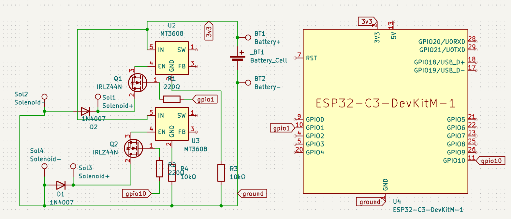

# CopyPad

An ESP32-powered adapter/cover for the Lutron Maestro Fan Control and Light Dimmer that allows for smart functionality, i.e. toggling on and off from a phone.

## Features

- **Wireless Connectivity**: Connect to the switch through Blynk from anywhere
- **Double Solenoid**: Control both switches - extremely quickly
- **Double Click**: Supports double click to set switch to max

*physical picture available soon!!*

## Project Structure

```
FanCtrl/
├── README.md  
├── JOURNAL.md               
├── cad/                    
│   └── FanCtrl.step     
├── firmware/                
│   └── main.ino          
├── pcb/                    
│   ├── FanCtrl.kicad_pcb   
│   ├── FanCtrl.kicad_sch   
│   ├── FanCtrl.kicad_pro   
│   ├── FanCtrl.kicad_prl
└── production/             
    ├── FanCtrtl_Baseplate.stl    
    ├── FanCtrl_Cover.stl     
    └── gerber.zip         
```

## Assembly

1. Solder all components according to the schematic
2. Flash `main.ino` to the microcontroller
3. 3D print the case files from `production/FanCtrtl_Baseplate.stl ` and `production/FanCtrl_Cover.stl`
4. Install the PCB into the case
5. Secure the top case with heatset inserts and screws

## Bill of Materials

| Component | Quantity | Description |
|-----------|----------|-------------|
| PCB | 1 | Manufactured from provided Gerber files |
| ESP32-C3 | 1 |  |
| IRLZ44N MOSFETs | 2 |  |
| CR2032 Coin Cell Batteries | 2 | 3v |
| CR2032 Battery Holder | 1 |  |
| Solenoid | 2 | 5v |
| MT3608 DC/DC Step Up Converter | 2x | 3.3v -> 5v |
| Case | 1 | 3D printed from provided STL files |
| Heatset Inserts | 4 | M3x5mx4mm |
| Screws | 4 | M3x16mm |
| Soldering Iron | 1 | For Assembly |


## Pictures




## License

This project is open source and available under the MIT License. See the LICENSE file for more details.
